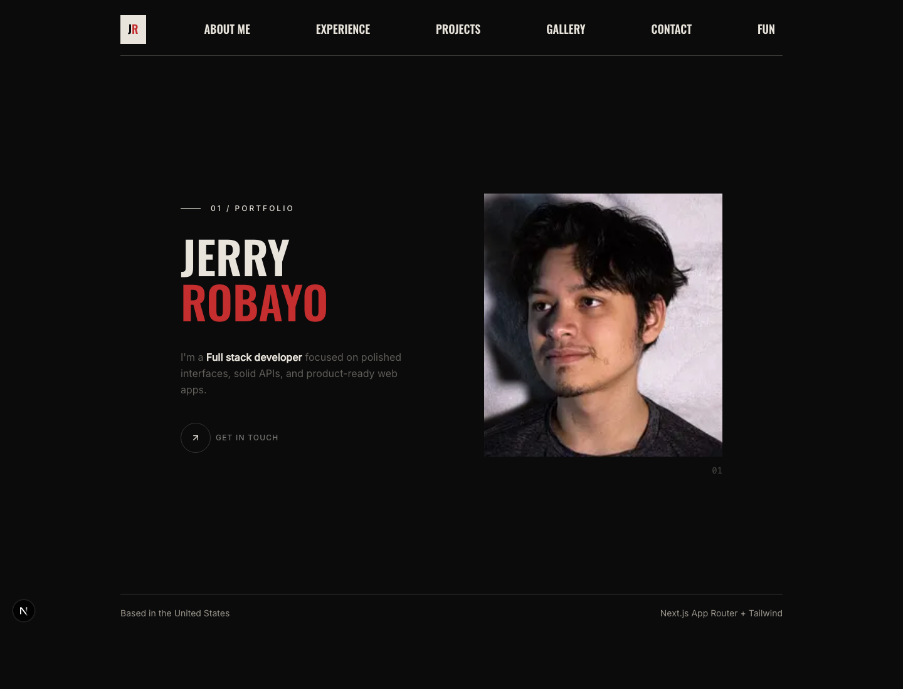

# Jerry's Portfolio V2

A dark, editorial portfolio template built with Next.js, TypeScript, and Tailwind CSS. This site was designed for my own developer portfolio, but the structure is reusable if you want a polished starting point for a personal site.



## About

Jerry's Portfolio V2 is a multi-page portfolio for a software engineer or full-stack developer. It includes a cinematic landing page, resume-driven about page, project cards, experience timeline, contact page, personal gallery, and a small Wordle-style daily game.

The design leans into a minimal black-and-red visual system with large condensed typography, sharp borders, and restrained interactions.

## Features

- Next.js App Router with TypeScript
- Tailwind CSS styling
- Responsive portfolio landing page
- About page with resume download and graduation countdown
- Experience and education sections
- Projects page with repo and live demo links
- Gallery with recent story-style media and flip gallery
- Contact page with functional mailto message flow
- Daily Wordle-style break page
- Custom JR favicon and metadata

## Tech Stack

- Next.js
- React
- TypeScript
- Tailwind CSS
- Framer Motion
- Lucide React
- Sonner

## Use It As A Template

You are free to use this project as a starting point for your own portfolio.

If you do, please credit the original design and code:

```txt
Original portfolio template by Jerry Robayo
https://github.com/LJebry/jerrys-portfolio-v2
```

You should replace my personal content before publishing your version:

- Name, bio, resume, and contact information
- Profile and gallery images
- Project links and descriptions
- GitHub and LinkedIn URLs
- Metadata in `src/app/layout.tsx`
- Resume file in `public/jerry-robayo-resume.pdf`

## Getting Started

Install dependencies:

```bash
npm install
```

Run the development server:

```bash
npm run dev
```

Open [http://localhost:3000](http://localhost:3000) in your browser.

Build for production:

```bash
npm run build
```

Run lint:

```bash
npm run lint
```

## Project Structure

```txt
src/app/                 App Router pages and metadata
src/components/          Page sections and shared components
src/components/ui/       Reusable UI components
src/lib/                 Utilities and shared logic
public/                  Static assets, images, resume, favicon
```

## License

This project is released under the MIT License. You can use, modify, and ship it, but keep the copyright and license notice.

Personal photos, resume content, and personal identity assets are included for my portfolio and should be replaced in your own version.

## Credit

Designed and built by [Jerry Robayo](https://github.com/LJebry).
